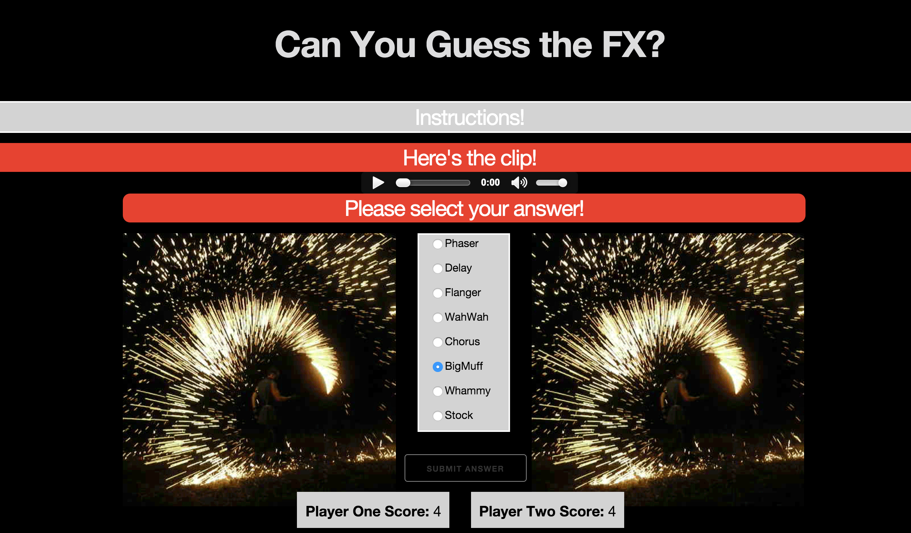

# Test Your Ear!
## Can you guess the FX?
***
#### WDI Project #1 / Can you guess the FX?
Concept: This is a game that will play random guitar samples with various guitar effects and user will be required to select an answer that they believe the guitarist or band is predominantly using.  The user will gain 1 point for every correct answer.  There is a total of 18 samples, therefor potential high score is 18.

## Landing Page

### Technologies used in creating this application:

- HTML5
- CSS
- JavaScript
- jQuery

### How to install and run

[Click to proceed to webage!](https://shawnfoster/Project1.github.io.git")

### Technical Requirements

Render a game in the browser BUT was not able to Switch turns between two players or more as I ran out of time.

Designed logic for winning & visually display which player won
Include separate HTML / CSS / JavaScript files
Stick with KISS (Keep It Simple Stupid) and DRY (Don't Repeat Yourself) principles
Use Javascript or jQuery for DOM manipulation
Deploy your game online, where the rest of the world can access it
Use semantic markup for HTML and CSS (adhere to best practices)
Necessary Deliverables

These are what you will be graded on!

A working game, built by you, hosted somewhere on the internet.

A link to your hosted working game in the URL section of your Github repo. This must be placed inside of your_username.github.io in a folder called project1. It will then be accessible via http://shawnfoster.github.io/Project1.github.io/

A git repository hosted on Github, with a link to your hosted game, and frequent commits dating back to the very beginning of the project. We strongly encourage you to work our of the repository your_username.github.io
A readme.md file with explanations of the technologies used, the approach taken, installation instructions, unsolved problems, etc.

## Keymaster to Effects

## Samples (Effects)
  - ### Stock
    - Slash - November Rain -
    - Randy Rhodes - Crazy Train
  - ### Big Muff
    - Bush - Glycerine
  - ### Chorus
    - Crowded House - Dont Dream Its over
    - Boston - More than a feeling 2:36
    - Police - Message in a bottle
    - Nirvana - Come as you are
  - ### Flanger
    - Lenny Kravitz - Are you going to go my way - Flanger
    - Heart - Barracuda
  - ### Phaser
    - Smashing Pumpkins - Soma - Phaser
    - Radiohead - Paranoid Android - Phaser
    - Eddie Van Halen - Beat It - Phaser
  - ### Wahwah
    - Living Colour - Cult of Personality - Wahwah
    - Steve Miller band - Joker - Wahwah
    - Slash - Sweet Child O' Mine - Wahwah
    - Joe Satriani - Surfing with the alient (Wahwah)
  - ### Delay
    - POD - Youth of a Nation (Delay)
    - U2 - With or Without You (Delay)
  - ### Whammy
    - Tom Morello - Like A Stone - Whammy
    - Rage Against The Machine - Killing in the name of
